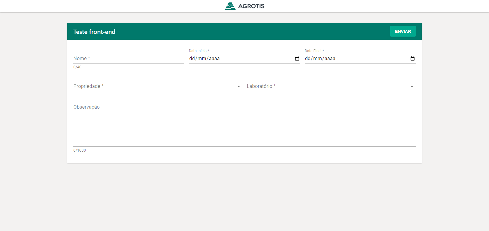
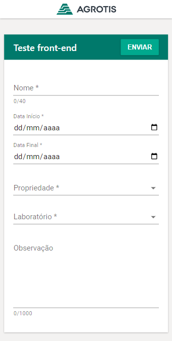

# Teste Front-end Plataforma
Teste para Front end do time plataforma.

# Rodar o projeto
- Basta baixar e rodar o comando 'yarn' 
- logo em seguida 'yarn dev'
- Preencha os campos e verifique no console o resultado

# Recursos utilizados
- vite
- React
- html / css 
- Style-conponents (componente: ActionAlert)
- Material-UI
- React Hook form


# Resultado do formulario
```
{
    
    "nome": "Jonathan Veturim Dias",
    "dataInicio": "2022-04-15",
    "dataFinal": "2022-05-01",
    "infosPropriedade": {
        "id": "10003",
        "nome": "Agrotis 3",
        "cnpj": "04.909.987/0001-87"
    },
    "laboratorio": {
        "id": "20002",
        "nome": "Umbrella Agro"
    },
    "observacoes": "Teste de formulário Agrotis"
}
```
# Telas


